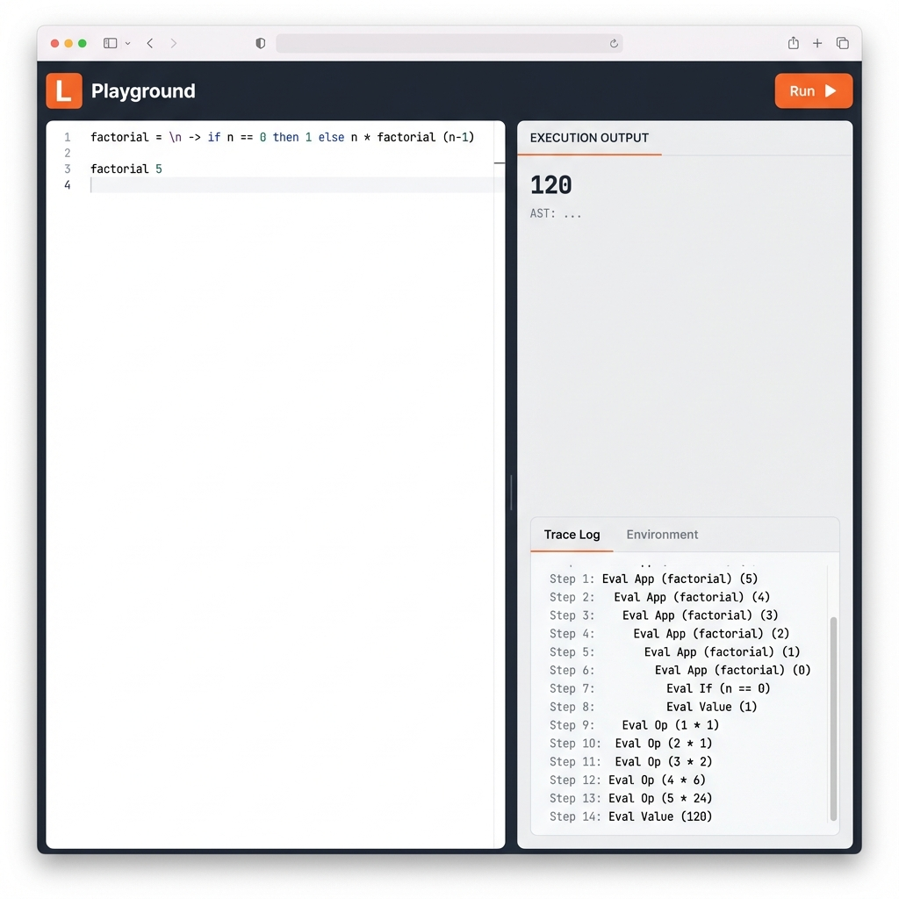

# L Language

**L** is a minimalist untyped functional programming language inspired by lambda calculus, designed for evaluating mathematical expressions and recursive functions.



## 🚀 Quick Start

### 1. Run the Web Playground

Experience L in a modern, interactive web interface.

```bash
stack run -- -w
```

Open **[http://localhost:3000](http://localhost:3000)** in your browser.

### 2. Run the CLI REPL

Use the interactive command-line interface.

```bash
stack run -- -r
```

## 📚 Documentation

Detailed documentation is available in the `docs/` directory:

- **[Getting Started](docs/getting_started.md)**: Installation, building, and running instructions.
- **[Language Reference](docs/language_reference.md)**: Syntax, built-in functions, and examples.
- **[Architecture Guide](docs/architecture.md)**: Overview of the codebase and project structure.

## 🌟 Key Features

- **Lambda Calculus Core**: First-class functions, recursion, and higher-order functions.
- **Simple Syntax**: Minimalist and easy to learn (similar to Haskell/ML).
- **Interactive Tools**: Built-in CLI REPL and Web Playground with execution tracing.
- **Traceable Execution**: See step-by-step evaluation of your code.
